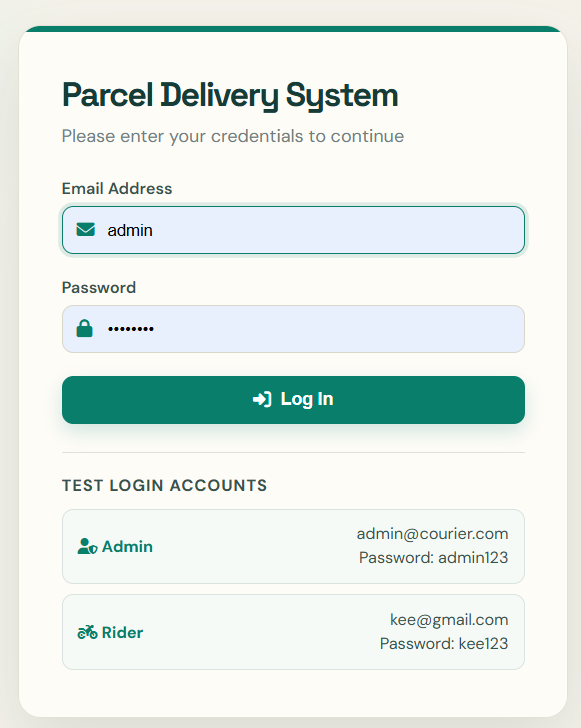
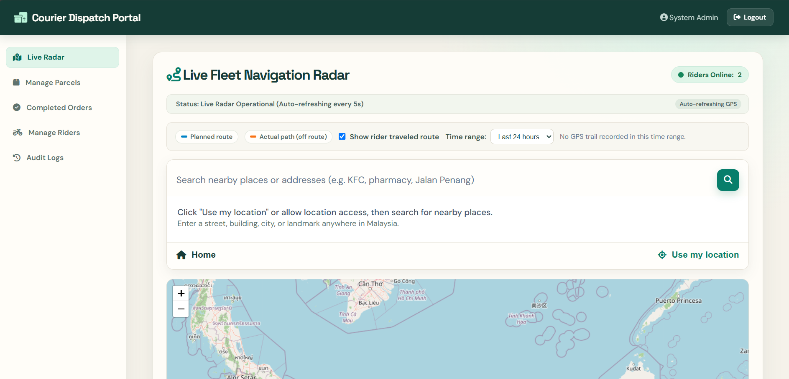
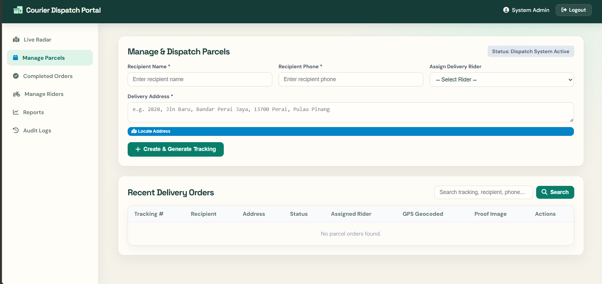
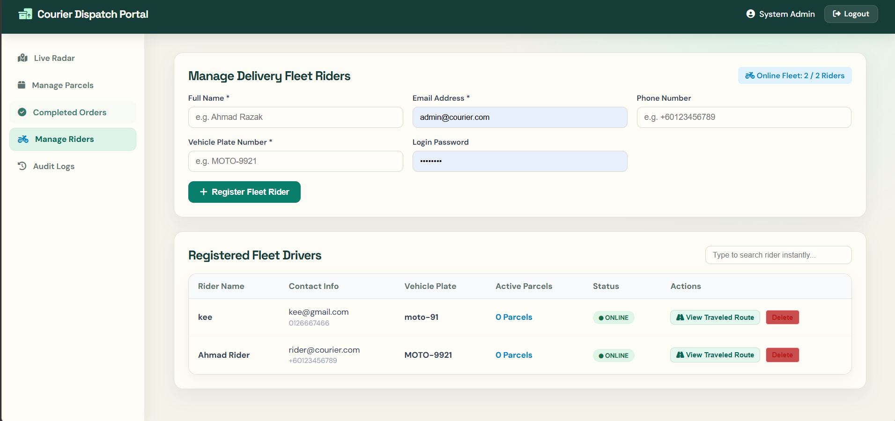

<div align="center">

# 📦 Parcel Delivery System

**A practical courier dispatch and fleet-tracking portal built with PHP and MySQL**


Create and assign parcels, manage delivery riders, monitor live locations, visualize routes, and retain delivery history from one portal.

[Features](#-features) · [Screenshots](#-screenshots) · [Installation](#-installation) · [User Roles](#-user-roles) · [Project Structure](#-project-structure)

</div>

---

## ✨ Features

| Area | Capabilities |
|---|---|
| Parcel management | Create parcels, assign riders, generate tracking records, search orders, and update delivery status |
| Live fleet radar | Display online riders, GPS locations, traveled paths, planned routes, and route deviations |
| Rider management | Register fleet riders, maintain vehicle details, review availability, and view traveled routes |
| Delivery workflow | Rider parcel list, parcel details, status updates, proof images, and completed-order history |
| Location tools | Address search, geocoding, reverse geocoding, current-road display, and map navigation |
| Administration | Completed orders, reports, rider records, and audit logs |

## 🖼️ Screenshots

<!-- Keep screenshots in pairs to preserve the balanced two-column layout. -->
<table>
  <tr>
    <td width="50%" align="center">
      <br>
      <sub><b>Secure Login</b></sub>
    </td>
    <td width="50%" align="center">
      <br>
      <sub><b>Live Fleet Navigation Radar</b></sub>
    </td>
  </tr>
  <tr>
    <td width="50%" align="center">
      <br>
      <sub><b>Parcel Management</b></sub>
    </td>
    <td width="50%" align="center">
      <br>
      <sub><b>Fleet Rider Management</b></sub>
    </td>
  </tr>
</table>

> Screenshots are displayed two per row. Add future screenshots in pairs to keep the gallery balanced.

## ✅ Requirements

- Apache web server (XAMPP is suitable for local development)
- PHP 8.0 or newer
- MySQL 5.7+ or MariaDB equivalent
- PHP extensions: `pdo_mysql`, `curl`, and `json`
- A modern browser with JavaScript and geolocation support
- Internet access for map tiles, address search, and route services

## 🚀 Installation

1. Place the project in your XAMPP web root:

   ```text
   C:\xampp\htdocs\delivery_system
   ```

2. Start **Apache** and **MySQL** from the XAMPP Control Panel.

3. Create a MySQL database and import:

   ```text
   api/schema.sql
   ```

4. Configure the database connection in `config/db.php`.

5. Open the application:

   ```text
   http://localhost/delivery_system/login.php
   ```

6. Use one of the test accounts displayed on the login page, then change all default credentials before deployment.

> Do not commit production database credentials. Prefer environment variables or a server-only configuration file outside the public repository.

## 👥 User Roles

| Role | Main Access |
|---|---|
| Administrator | Live radar, parcel dispatch, completed orders, rider management, reports, and audit logs |
| Rider | Assigned parcels, parcel details, delivery status updates, proof images, profile, and completed orders |

## 🗺️ Location and Route Behaviour

- Rider location access depends on browser permission and device GPS availability.
- Live Radar refreshes location data periodically while the relevant pages and services are running.
- Address search and route visualization depend on external map/geocoding services and internet connectivity.
- A successful source or PHP syntax check does not by itself confirm browser GPS, map tiles, or hosted route behaviour.

## 📁 Project Structure

```text
delivery_system/
├── admin/                 # Admin radar, parcels, riders, reports, and audit pages
├── api/                   # AJAX, GPS, address, route, and parcel endpoints
├── assets/                # Shared styles and browser-side scripts
├── config/                # Database and external-service configuration
├── delivery_management/   # Delivery management entry point
├── includes/              # Authentication, layout, helpers, and rider presence
├── rider/                 # Rider dashboard, parcels, profile, and history
├── screenshots/           # README screenshots, maintained in pairs
├── uploads/               # Uploaded delivery proof images
├── login.php              # Shared login page
└── logout.php             # Session logout handler
```

## 🔐 Deployment Notes

- Replace all demonstration passwords before publishing the application.
- Keep database credentials and service keys out of Git and public web output.
- Restrict write access to `uploads/` and validate uploaded file types on the server.
- Use HTTPS in production, especially for authentication and browser geolocation.
- Verify GPS, maps, routes, uploads, and permissions in the actual hosted environment.

## 📄 License

This project is licensed under the **MIT License**. You may use, modify, and distribute the project for personal, educational, or commercial purposes, provided that the original copyright and license notice are retained.

```text
MIT License

Copyright (c) 2026 Parcel Delivery System

Permission is hereby granted, free of charge, to any person obtaining a copy
of this software and associated documentation files (the "Software"), to deal
in the Software without restriction, including without limitation the rights
to use, copy, modify, merge, publish, distribute, sublicense, and/or sell
copies of the Software, and to permit persons to whom the Software is
furnished to do so, subject to the following conditions:

The above copyright notice and this permission notice shall be included in all
copies or substantial portions of the Software.

THE SOFTWARE IS PROVIDED "AS IS", WITHOUT WARRANTY OF ANY KIND, EXPRESS OR
IMPLIED, INCLUDING BUT NOT LIMITED TO THE WARRANTIES OF MERCHANTABILITY,
FITNESS FOR A PARTICULAR PURPOSE AND NONINFRINGEMENT. IN NO EVENT SHALL THE
AUTHORS OR COPYRIGHT HOLDERS BE LIABLE FOR ANY CLAIM, DAMAGES OR OTHER
LIABILITY, WHETHER IN AN ACTION OF CONTRACT, TORT OR OTHERWISE, ARISING FROM,
OUT OF OR IN CONNECTION WITH THE SOFTWARE OR THE USE OR OTHER DEALINGS IN THE
SOFTWARE.
```

---

<div align="center">
  <sub>Built for courier dispatch, parcel visibility, and delivery fleet coordination.</sub>
</div>
